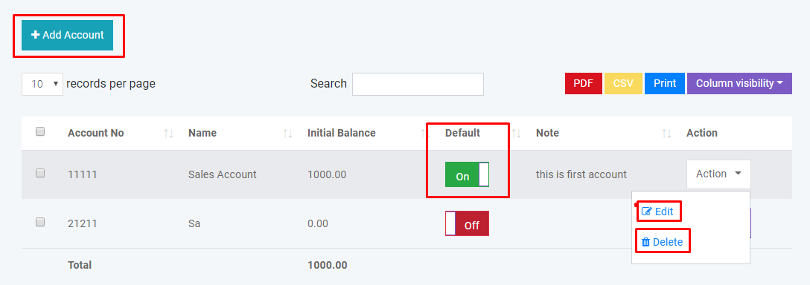
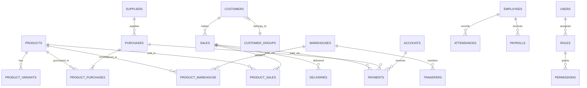

<](https://laravel.com)
[](https://php.net)
[](https://www.mysql.com)
[](https://getbootstrap.com)
[](LICENSE)
[](https://github.com/LALITHD-21/Point-of-sales-system-POS-/pulls)

<br/>

<p align="center">
  <strong>An all-in-one business management platform designed for retail stores, super shops, wholesale businesses, and multi-warehouse enterprises. Manage your inventory, process sales, handle accounting, and oversee HR — all from a single, elegant dashboard.</strong>
</p>

---

[Features](#-features) •
[Tech Stack](#-tech-stack) •
[Installation](#-installation) •
[Usage](#-usage) •
[Architecture](#-architecture) •
[Reports](#-reports) •
[Multi-Language](#-multi-language-support) •
[Contributing](#-contributing)

</div>

---

## 📸 Preview

| Dashboard | POS Interface | Invoice |
|:---------:|:-------------:|:-------:|
|  |  |  |

| Purchase Management | Accounting | Reports |
|:-------------------:|:----------:|:-------:|
|  |  |  |

---

## ✨ Features

<table>
<tr>
<td width="50%">

### 🏪 Point of Sale (POS)
- 🖥️ Touch-screen optimized POS interface
- 📷 Barcode scanning & product search
- 🏷️ Barcode label printing (36mm, 24mm, 18mm)
- 💳 Multiple payment methods (Cash, Card, PayPal, Gift Card, Cheque)
- 🎁 Gift card creation & recharge system
- 🎟️ Coupon & discount management
- 🧾 Beautiful auto-generated invoices
- 📧 Automatic email notifications to customers
- 💰 Cash register management

</td>
<td width="50%">

### 📦 Inventory Management
- 📋 Product categories, brands & units
- 📊 Standard, Digital & Combo product types
- 🏭 Multi-warehouse support
- 🔄 Inter-warehouse stock transfers
- 📉 Quantity adjustment (Addition/Subtraction)
- 📦 Stock count (Full & Partial)
- ⚠️ Low stock quantity alerts
- 📥 CSV bulk import/export
- 🔍 Advanced search & filtering

</td>
</tr>
<tr>
<td width="50%">

### 🛍️ Sales & Purchase
- 📝 Complete purchase order management
- 🛒 Sales with multiple status tracking
- 📬 Quotation management (with sale/purchase conversion)
- 🔙 Purchase & sale return handling
- 🚚 Delivery tracking & management
- 💵 Partial payments & deposit support
- 📄 Payment via Stripe & PayPal integration
- 📨 Automated confirmation emails

</td>
<td width="50%">

### 💼 HRM (Human Resource Management)
- 🏢 Department management
- 👥 Employee records & user access control
- ⏰ Attendance tracking (Check-in/Check-out)
- 💰 Payroll processing
- 🎄 Holiday management
- 🔐 Role-based permissions (RBAC)
- 📊 Employee reporting

</td>
</tr>
<tr>
<td width="50%">

### 📊 Accounting
- 🏦 Multi-account management
- 📖 Balance sheet generation
- 📝 Account statements
- 💸 Expense tracking & categorization
- 🔄 Money transfer between accounts
- 📈 Cash flow visualization
- 💰 Profit/Loss calculations

</td>
<td width="50%">

### 👥 People Management
- 👤 User management with role-based access
- 🛒 Customer management with deposits
- 🏢 Biller management (multi-company)
- 🤝 Supplier management
- 📧 Automated welcome emails
- 📊 Customer grouping with custom pricing
- 📱 SMS notifications (Twilio/Clickatell)

</td>
</tr>
</table>

---

## 🛠️ Tech Stack

<div align="center">

| Layer | Technology |
|:------|:-----------|
| **Backend Framework** | Laravel 8.x (PHP ≥ 7.4) |
| **Database** | MySQL / MariaDB |
| **Frontend** | Blade Templates, Bootstrap 4, jQuery |
| **Authentication** | Laravel Auth with RBAC (Spatie Permissions) |
| **Payment Gateway** | Stripe, PayPal (srmklive/paypal) |
| **Excel/CSV** | Maatwebsite Excel 3.x |
| **Image Processing** | Intervention Image |
| **Barcode Generation** | milon/barcode |
| **SMS Gateway** | Twilio SDK |
| **PDF Generation** | Built-in PDF export |
| **Web Server** | Apache / Nginx |
| **PWA Support** | Service Worker + Manifest |

</div>

---

## 🏗️ Architecture

```
salepro/
├── app/
│   ├── Http/
│   │   ├── Controllers/          # 40+ controllers for all modules
│   │   │   ├── SaleController    # POS & Sales management
│   │   │   ├── PurchaseController# Purchase & procurement
│   │   │   ├── ProductController # Product & inventory
│   │   │   ├── AccountsController# Accounting module
│   │   │   ├── EmployeeController# HRM module
│   │   │   ├── ReportController  # Reporting engine
│   │   │   └── ...
│   │   └── Middleware/
│   ├── Notifications/            # Email & SMS notifications
│   ├── Providers/
│   └── StockCount/               # Stock counting logic
├── config/                       # App configuration
├── database/
│   ├── migrations/               # Database schema
│   ├── factories/                # Test data factories
│   └── seeders/                  # Database seeders
├── public/                       # Public assets
├── resources/
│   ├── views/                    # Blade templates
│   └── lang/                     # Multi-language files (11 languages)
├── routes/                       # Application routes
├── storage/                      # File storage
├── service-worker.js             # PWA support
└── manifest.json                 # PWA manifest
```

### Database Schema — 60+ Tables



---

## 🚀 Installation

### Prerequisites

| Requirement | Version |
|:------------|:--------|
| PHP | ≥ 7.4 |
| MySQL / MariaDB | 5.7+ / 10.x |
| Apache / Nginx | Latest |
| Composer | Latest |

#### Required PHP Extensions
```
✅ OpenSSL    ✅ PDO         ✅ Fileinfo
✅ Mbstring   ✅ Tokenizer   ✅ Zip Archive
✅ Mod Rewrite (enabled)
```

### 📋 Step-by-Step Installation

#### Option A: Localhost (XAMPP/WAMP/MAMP)

```bash
# 1. Clone the repository
git clone https://github.com/LALITHD-21/Point-of-sales-system-POS-.git
cd Point-of-sales-system-POS-

# 2. Copy the project folder to your htdocs directory
# (e.g., C:\xampp\htdocs\salepro)

# 3. Create a MySQL database named 'salepro'
mysql -u root -p -e "CREATE DATABASE salepro;"

# 4. Import the database schema
mysql -u root -p salepro < database.sql

# 5. Configure the .env file
cp .env.example .env
# Edit .env with your database credentials:
#   DB_DATABASE=salepro
#   DB_USERNAME=root
#   DB_PASSWORD=your_password

# 6. Install dependencies
composer install

# 7. Generate application key
php artisan key:generate

# 8. Access the application
# Visit: http://localhost/salepro
```

#### Option B: Production Server

```bash
# 1. Upload the project files to your hosting
# 2. Create a MySQL database via cPanel/Plesk
# 3. Import database.sql via phpMyAdmin
# 4. Configure .env with production database credentials
# 5. Ensure the web server points to the public/ directory
# 6. Set proper file permissions
chmod -R 775 storage/
chmod -R 775 bootstrap/cache/
```

### 🔑 Default Login Credentials

| Role | Username | Password |
|:-----|:---------|:---------|
| **Admin** | `admin` | `admin` |

> ⚠️ **Important:** Change the default credentials immediately after your first login!

---

## 📖 Usage

### POS Interface
1. Navigate to **Sale → POS** from the sidebar
2. Select or scan products using the barcode scanner
3. Click product images to add items to the cart
4. Apply discounts, taxes, or coupons as needed
5. Click **Payment** to finalize the transaction
6. Choose payment method (Cash, Card, PayPal, Gift Card)
7. Invoice is auto-generated and emailed to the customer

### Inventory Management
1. **Add Products:** Navigate to Products → Add Product
2. **Purchase Stock:** Create a purchase order to add stock quantities
3. **Transfer Stock:** Use Transfer module for inter-warehouse movements
4. **Stock Count:** Run full or partial stock counts with CSV export
5. **Adjustments:** Fine-tune quantities with the Adjustment module

### POS Printer Setup
1. Install your thermal printer driver
2. Go to **Settings → Devices & Printers**
3. Set your POS printer as the default
4. Configure paper size (select the 3rd option) in printer preferences
5. Print invoices directly from the POS interface

---

## 📊 Reports

SalePro generates **16+ comprehensive reports** to give you complete business visibility:

| Report Category | Reports |
|:----------------|:--------|
| **Financial** | Profit/Loss Report, Payment Report, Due Report |
| **Sales** | Daily Sale, Monthly Sale, Sale Report, Best Seller |
| **Purchase** | Daily Purchase, Monthly Purchase, Purchase Report |
| **Inventory** | Product Report, Warehouse Stock Chart, Quantity Alert |
| **People** | User Report, Customer Report, Supplier Report |

---

## 🌍 Multi-Language Support

SalePro comes pre-loaded with **11 languages** and is easily extensible:

<div align="center">

| 🇺🇸 English | 🇪🇸 Spanish | 🇫🇷 French | 🇸🇦 Arabic |
|:-----------:|:-----------:|:----------:|:----------:|
| 🇵🇹 Portuguese | 🇩🇪 German | 🇳🇱 Dutch | 🇮🇳 Hindi |
| 🇮🇹 Italian | 🇷🇺 Russian | 🇹🇷 Turkish | ➕ *Add yours!* |

</div>

> 📝 To add a new language or customize translations, edit the files in `resources/lang/`

---

## 💳 Payment Integrations

<div align="center">

| Method | Status | Provider |
|:-------|:------:|:---------|
| 💵 Cash | ✅ Built-in | — |
| 💳 Credit Card | ✅ Integrated | Stripe |
| 🅿️ PayPal | ✅ Integrated | PayPal Live API |
| 🎁 Gift Card | ✅ Built-in | — |
| 📝 Cheque | ✅ Built-in | — |
| 💰 Customer Deposit | ✅ Built-in | — |

</div>

---

## 📱 SMS & Notifications

- **Email:** Automated emails for sales, payments, deliveries, returns, and quotations
- **SMS:** Bulk SMS via **Twilio** and **Clickatell** integration
- **In-App:** Real-time notification system

---

## ⚙️ Configuration

### General Settings
- Site Title & Logo customization
- Currency & Timezone configuration
- Date format preferences
- Theme color selection
- Staff access controls

### POS Settings
- Default customer, biller & warehouse
- Featured products display count
- Stripe & PayPal API keys
- Payment gateway configuration

### HRM Settings
- Default check-in / check-out times
- Holiday calendar management
- Payroll account configuration

### Mail Server
Configure SMTP settings under **Settings → Mail Setting** for automated email delivery.

---

## 🔐 Role-Based Access Control (RBAC)

SalePro uses **Spatie Laravel Permission** for granular access control:

- Create custom roles with specific permissions
- Assign roles to users for module-level access
- Control visibility and actions per role
- Admin, Manager, Cashier — define as many roles as needed

---

## 🤝 Contributing

Contributions are welcome! Here's how you can help:

1. **Fork** the repository
2. **Create** a feature branch (`git checkout -b feature/amazing-feature`)
3. **Commit** your changes (`git commit -m 'Add amazing feature'`)
4. **Push** to the branch (`git push origin feature/amazing-feature`)
5. **Open** a Pull Request

---

## 🐛 Troubleshooting

<details>
<summary><strong>500 Server Error after installation</strong></summary>

1. Update PHP to version 7.4 or later
2. Open `.env` file and set `APP_DEBUG=true`
3. Revisit the page to see the actual error description
4. Check file permissions on `storage/` and `bootstrap/cache/`
</details>

<details>
<summary><strong>Missing .htaccess or .env files</strong></summary>

Enable "Show hidden files" in your file manager/hosting panel to ensure `.htaccess` and `.env` are properly copied.
</details>

<details>
<summary><strong>Barcode printing issues</strong></summary>

We recommend using a **Brother Label Printer** with supported paper sizes: 36mm, 24mm, or 18mm.
</details>

---

## 📄 License

This project is licensed under the **MIT License** — see the [LICENSE](LICENSE) file for details.

---

<div align="center">

### ⭐ Star this repo if you find it useful!

**Built with ❤️ using Laravel**

[](https://github.com/LALITHD-21/Point-of-sales-system-POS-/stargazers)
[](https://github.com/LALITHD-21/Point-of-sales-system-POS-/network/members)

</div>
]]>
