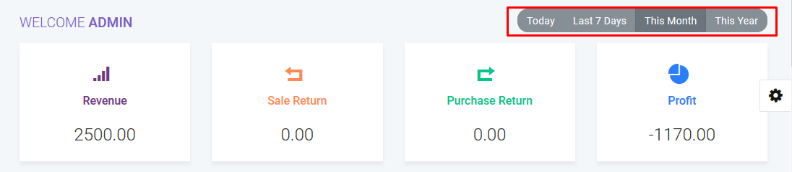
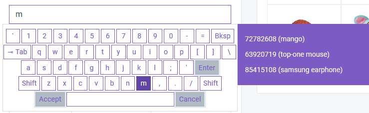
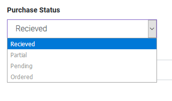
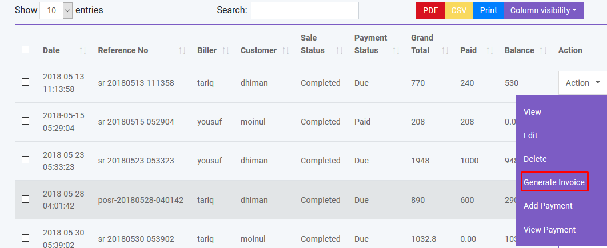
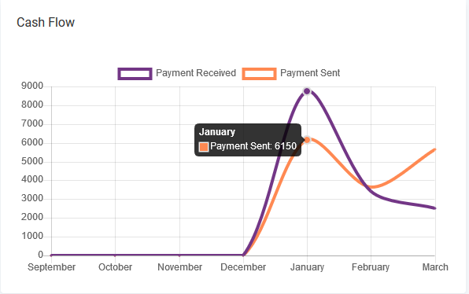
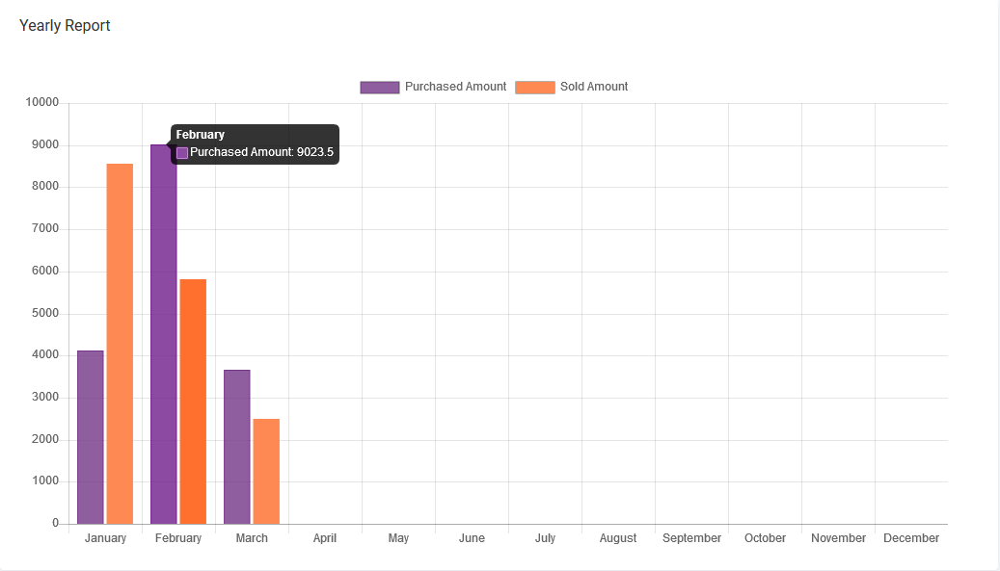

<div align="center">
  


<br/>
<br/>


<br/>

[](https://laravel.com)
[](https://php.net)
[](https://www.mysql.com)
[](https://getbootstrap.com)
[](https://jquery.com)
[](https://stripe.com)
[](https://paypal.com)
[](LICENSE)

<br/>

**A complete business management platform for retail stores, super shops, wholesale businesses,**  
**and multi-warehouse enterprises — manage inventory, sales, accounting & HR from one dashboard.**

<br/>

[📋 Features](#-key-features) · [🚀 Quick Start](#-quick-start) · [📸 Screenshots](#-screenshots) · [📊 Reports](#-reports--analytics) · [🤝 Contributing](#-contributing)

<br/>
<br/>

</div>

---

## 📸 Screenshots

<div align="center">

|  |  |
|:---:|:---:|
|  |  |
| **📊 Real-Time Dashboard** | **🖥️ POS Interface** |
|  |  |
| **🛒 Purchase Management** | **🧾 Auto-Generated Invoice** |
|  |  |
| **💰 Cash Flow Analytics** | **📈 Yearly Sales vs Purchase** |

</div>

---

## 📋 Key Features

<div align="center">

### 🏪 Point of Sale

</div>

> A touch-screen optimized, fast POS interface built for speed and simplicity.

- ⚡ **Instant product search** — type name or scan barcode to add items
- 🖼️ **Visual product grid** — tap featured product images to add to cart
- 💳 **6 payment methods** — Cash, Credit Card (Stripe), PayPal, Gift Card, Cheque, Customer Deposit
- 🧾 **Auto-generated invoices** — beautifully designed, printable & emailable
- 🎁 **Gift cards** — create, sell & recharge; customers use them at checkout
- 🎟️ **Coupons & discounts** — apply order-level tax, discount & shipping
- 🖨️ **POS thermal printing** — supports 36mm, 24mm & 18mm receipt paper
- 💰 **Cash register** — track opening & closing balances per shift
- ⌨️ **On-screen keyboard** — built-in touch keyboard for kiosk/tablet mode

---

<div align="center">

### 📦 Inventory Management

</div>

> Smart stock tracking across multiple warehouses with real-time quantity updates.

- 🏭 **Multi-warehouse** — track stock per warehouse, transfer between locations
- 📋 **3 product types** — Standard, Digital & Combo (e.g. juice = mango + sugar)
- 📊 **Auto stock updates** — purchase adds stock, sale deducts it — zero manual work
- 🔄 **Stock transfers** — move products between warehouses with full tracking
- 📉 **Quantity adjustment** — add or subtract stock with audit trail
- 📦 **Stock count** — full or partial count, export to CSV, auto-adjust quantities
- ⚠️ **Low stock alerts** — get notified when product quantity drops below threshold
- 🏷️ **Barcode generation** — print barcode labels on Brother label printers
- 📥 **Bulk CSV import** — import products, categories, brands & units from CSV

---

<div align="center">

### 🛍️ Sales & Purchases

</div>

> Complete buy-to-sell lifecycle with quotations, orders, payments & returns.

- 🛒 **Sales management** — create sales from POS or manual entry, track status
- 📝 **Purchase orders** — manage supplier purchases with partial/pending/received status
- 📬 **Quotations** — create quotes, convert to sale or purchase in one click
- 🔙 **Returns** — handle both customer returns & supplier returns with auto stock update
- 🚚 **Delivery tracking** — manage deliveries with automatic customer email notifications
- 💵 **Partial payments** — accept multiple partial payments per transaction
- 📧 **Auto emails** — sale confirmation, payment receipt, delivery & return notifications
- 📄 **CSV import** — bulk import sales, purchases & transfers from spreadsheets

---

<div align="center">

### 💼 Accounting & Finance

</div>

> Track every penny with multi-account management and auto-generated financial reports.

- 🏦 **Multiple accounts** — create & manage bank accounts, set default for sales
- 📖 **Balance sheet** — auto-generated balance sheet across all accounts
- 📝 **Account statements** — detailed transaction history per account
- 💸 **Expense tracking** — categorize & track all business expenses
- 🔄 **Money transfers** — transfer funds between accounts with full audit trail
- 📈 **Cash flow charts** — visual line charts showing income vs expenditure
- 🍩 **Spending breakdown** — doughnut charts for purchase, revenue & expense ratios
- 💰 **Profit/Loss** — auto-calculated P&L with date range filtering

---

<div align="center">

### 👥 HRM Module

</div>

> Manage your team with attendance tracking, payroll & department organization.

- 🏢 **Departments** — organize employees by department
- 👤 **Employee records** — full employee profiles with user account access
- ⏰ **Attendance** — daily check-in/check-out with configurable default times
- 💰 **Payroll** — process employee salaries from specific accounts
- 🎄 **Holidays** — manage holiday calendar & approve leave requests
- 🔐 **Role-based access (RBAC)** — granular permissions per role using Spatie
- 📊 **HR reports** — attendance & payroll reporting

---

<div align="center">

### 👥 People Management

</div>

> Centralized management of all stakeholders — users, customers, billers & suppliers.

- 👤 **Users** — create accounts with role assignment; password auto-emailed
- 🛒 **Customers** — manage customer database, group pricing & wallet deposits
- 🏢 **Billers** — multi-company support; each biller represents a business entity
- 🤝 **Suppliers** — track vendors you purchase from with contact details
- 📊 **Customer groups** — set group-specific price percentages (wholesale vs retail)
- 📱 **SMS notifications** — bulk SMS via Twilio & Clickatell with country code support
- 📧 **Auto-emails** — welcome emails on creation for customers, billers & suppliers
- 📥 **CSV import** — bulk import people data from spreadsheets

---

## 🛠️ Tech Stack

```
┌─────────────────────────────────────────────────────────────────┐
│                        FRONTEND                                 │
│  Bootstrap 4  ·  jQuery  ·  Blade Templates  ·  PWA Ready       │
├─────────────────────────────────────────────────────────────────┤
│                        BACKEND                                  │
│  Laravel 8.x  ·  PHP ≥ 7.4  ·  Spatie Permissions (RBAC)       │
├─────────────────────────────────────────────────────────────────┤
│                      INTEGRATIONS                               │
│  Stripe  ·  PayPal  ·  Twilio SMS  ·  Clickatell SMS            │
├─────────────────────────────────────────────────────────────────┤
│                       LIBRARIES                                 │
│  Maatwebsite Excel · Intervention Image · milon/barcode         │
│  kwn/number-to-words · GuzzleHTTP · gladcodes/keygen            │
├─────────────────────────────────────────────────────────────────┤
│                       DATABASE                                  │
│  MySQL / MariaDB  ·  60+ Tables  ·  Doctrine DBAL               │
├─────────────────────────────────────────────────────────────────┤
│                        SERVER                                   │
│  Apache / Nginx  ·  Mod Rewrite  ·  SSL Ready                   │
└─────────────────────────────────────────────────────────────────┘
```

---

## 🗂️ Project Structure

```
salepro/
│
├── app/
│   ├── Http/Controllers/        # 40+ controllers
│   │   ├── SaleController       # POS & sales
│   │   ├── PurchaseController   # Procurement
│   │   ├── ProductController    # Inventory
│   │   ├── AccountsController   # Finance
│   │   ├── EmployeeController   # HRM
│   │   ├── ReportController     # Analytics
│   │   ├── GiftCardController   # Gift cards
│   │   ├── CouponController     # Coupons
│   │   └── ...38 more
│   ├── Notifications/           # Email & SMS alerts
│   └── StockCount/              # Stock counting logic
│
├── resources/
│   ├── views/                   # 80+ Blade templates
│   └── lang/                    # 11 language packs
│
├── database/
│   └── database.sql             # Full schema (60+ tables)
│
├── routes/web.php               # Application routes
├── service-worker.js            # PWA offline support
└── manifest.json                # PWA manifest
```

---

## 🗄️ Database Schema

60+ tables powering the entire platform:

```mermaid
erDiagram
    PRODUCTS ||--o{ PRODUCT_SALES : "sold in"
    PRODUCTS ||--o{ PRODUCT_PURCHASES : "purchased in"
    PRODUCTS ||--o{ PRODUCT_WAREHOUSE : "stored in"
    PRODUCTS ||--o{ PRODUCT_VARIANTS : "has variants"
    PRODUCTS }o--|| CATEGORIES : "belongs to"
    PRODUCTS }o--|| BRANDS : "made by"
    SALES ||--|{ PRODUCT_SALES : contains
    SALES ||--o{ PAYMENTS : "paid via"
    SALES ||--o{ DELIVERIES : delivered
    SALES }o--|| CUSTOMERS : "sold to"
    PURCHASES ||--|{ PRODUCT_PURCHASES : contains
    PURCHASES ||--o{ PAYMENTS : "paid via"
    PURCHASES }o--|| SUPPLIERS : "bought from"
    CUSTOMERS }o--|| CUSTOMER_GROUPS : "belongs to"
    CUSTOMERS ||--o{ DEPOSITS : "has balance"
    WAREHOUSES ||--o{ PRODUCT_WAREHOUSE : stocks
    WAREHOUSES ||--o{ TRANSFERS : "transfers from/to"
    ACCOUNTS ||--o{ PAYMENTS : receives
    ACCOUNTS ||--o{ MONEY_TRANSFERS : "transfers between"
    EMPLOYEES ||--o{ ATTENDANCES : records
    EMPLOYEES ||--o{ PAYROLLS : receives
    EMPLOYEES }o--|| DEPARTMENTS : "works in"
    USERS }o--o{ ROLES : assigned
    ROLES }o--o{ PERMISSIONS : grants
```



---

## 🚀 Quick Start

### Prerequisites

| Requirement | Minimum Version |
|:--|:--|
| **PHP** | 7.4+ |
| **MySQL** or **MariaDB** | 5.7+ / 10.x |
| **Apache** or **Nginx** | Latest |
| **Composer** | Latest |

**Required PHP Extensions:**

```
OpenSSL  ·  PDO  ·  Fileinfo  ·  Mbstring  ·  Tokenizer  ·  Zip  ·  Mod Rewrite
```

### Installation

**1 → Clone & enter the project**
```bash
git clone https://github.com/LALITHD-21/Point-of-sales-system-POS-.git
cd Point-of-sales-system-POS-
```

**2 → Create database & import schema**
```bash
mysql -u root -p -e "CREATE DATABASE salepro;"
mysql -u root -p salepro < database.sql
```

**3 → Configure environment**
```bash
cp .env.example .env
```
Edit `.env` and set your database credentials:
```env
DB_DATABASE=salepro
DB_USERNAME=root
DB_PASSWORD=your_password
```

**4 → Install dependencies & generate key**
```bash
composer install
php artisan key:generate
```

**5 → Launch**
```
http://localhost/salepro
```

### 🔐 Default Login

| | |
|:--|:--|
| **Username** | `admin` |
| **Password** | `admin` |

> ⚠️ **Change these credentials immediately after first login.**

---

## 💳 Payment Methods

| Method | Provider | Status |
|:--|:--|:--:|
| Cash | Built-in | ✅ |
| Credit / Debit Card | **Stripe** | ✅ |
| PayPal | **PayPal Live API** | ✅ |
| Gift Card | Built-in | ✅ |
| Cheque | Built-in | ✅ |
| Customer Deposit | Built-in | ✅ |

---

## 📊 Reports & Analytics

**16 built-in reports** for complete business visibility:

| Category | Reports |
|:--|:--|
| 💰 **Financial** | Profit / Loss · Payment Report · Due Report |
| 🛒 **Sales** | Daily Sale · Monthly Sale · Sale Report · Best Seller |
| 📦 **Purchase** | Daily Purchase · Monthly Purchase · Purchase Report |
| 📋 **Inventory** | Product Report · Warehouse Stock Chart · Quantity Alert |
| 👥 **People** | User Report · Customer Report · Supplier Report |

Plus interactive **dashboard charts**: cash flow line chart, purchase/revenue/expense doughnut, yearly bar chart, and top 5 best-selling products.

---

## 🌍 Languages

Supports **11 languages** out of the box — switch from **Settings → General Settings**:

| | | | |
|:--:|:--:|:--:|:--:|
| 🇺🇸 English | 🇪🇸 Spanish | 🇫🇷 French | 🇸🇦 Arabic |
| 🇵🇹 Portuguese | 🇩🇪 German | 🇳🇱 Dutch | 🇮🇳 Hindi |
| 🇮🇹 Italian | 🇷🇺 Russian | 🇹🇷 Turkish | ➕ **Add yours** |

> Add or customize translations in `resources/lang/`

---

## 🔐 Access Control

Role-based access control powered by **Spatie Laravel Permission**:

- **Create custom roles** — Admin, Manager, Cashier, Accountant, or any role you need
- **Granular permissions** — control access to each module and action
- **User registration** — staff can self-register, admin approves activation
- **Activity tracking** — know who did what with user-level audit

---

## 🐛 Troubleshooting

<details>
<summary><b>500 Server Error after installation</b></summary>
<br/>

1. Ensure PHP version is **7.4 or later**
2. Set `APP_DEBUG=true` in your `.env` file to see the real error
3. Check permissions: `chmod -R 775 storage/ bootstrap/cache/`
4. Verify all required PHP extensions are installed
</details>

<details>
<summary><b>Missing .htaccess or .env files</b></summary>
<br/>

These are hidden files. Enable **"Show hidden files"** in your file manager or hosting panel before copying/moving the project.
</details>

<details>
<summary><b>Barcode not printing correctly</b></summary>
<br/>

- Use a **Brother Label Printer** for best results
- Supported paper sizes: **36mm**, **24mm**, **18mm** only
- Set the correct paper size in both printer preferences and print dialog
</details>

<details>
<summary><b>Emails not sending</b></summary>
<br/>

Configure your SMTP settings under **Settings → Mail Setting** with your mail provider's host, port, username & password.
</details>

---

## 🤝 Contributing

```bash
# 1. Fork the repo
# 2. Create your feature branch
git checkout -b feature/awesome-feature

# 3. Commit your changes
git commit -m "Add awesome feature"

# 4. Push to the branch
git push origin feature/awesome-feature

# 5. Open a Pull Request
```

---

## 📄 License

This project is licensed under the **MIT License** — see the [LICENSE](LICENSE) file for details.

---

<div align="center">

<br/>

**If this project helped you, please give it a ⭐**

[](https://github.com/LALITHD-21/Point-of-sales-system-POS-/stargazers)
[](https://github.com/LALITHD-21/Point-of-sales-system-POS-/network/members)
[](https://github.com/LALITHD-21/Point-of-sales-system-POS-/watchers)

<br/>

**Built with ❤️ using [Laravel](https://laravel.com)**

<br/>

</div>
